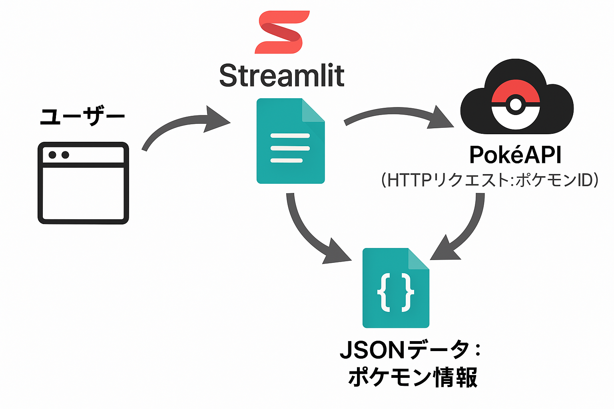
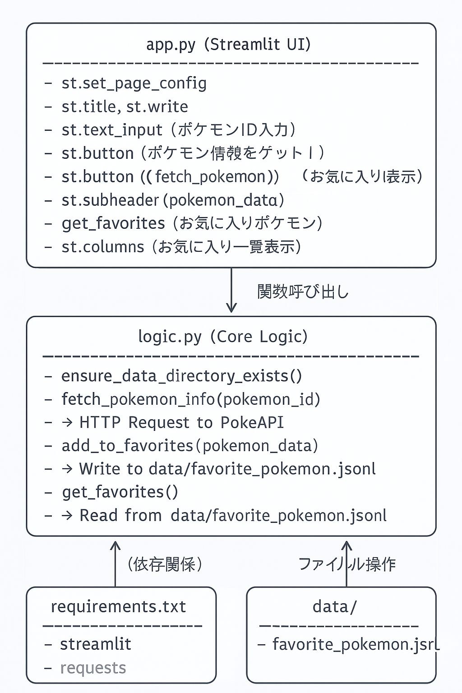

# 22060006_川端美羽_AIprograming課題2

improvement.md (C:\AIプログラミング4\improvement.md)

 - ポケモン図鑑アプリ     

 概要
ポケモン図鑑Webアプリケーション
ユーザーがポケモンの図鑑番号（ID）を入力することで、そのポケモンの名前、タイプ、特性、画像などの詳細情報を表示します。
さらに、表示されたポケモンを「お気に入り」として保存し、後で一覧で確認できる機能も備わっています。

使用技術
Python
Streamlit
Requests: 外部APIとの通信に使用
PokeAPI: ポケモンの情報を取得するための無料・オープンソースのWeb API (https://pokeapi.co/)

機能一覧
ポケモン情報検索: ポケモンの図鑑番号（ID）を入力し、ボタンをクリックすることで、そのポケモンの詳細情報（名前、ID、タイプ、特性、画像）を表示します。

お気に入り保存: 表示されたポケモンを「お気に入り」として保存できます。

保存されたデータは、data/favorite_pokemon.jsonlファイルにJSON Lines形式で書き込まれます。

お気に入り一覧表示: 保存されたお気に入りのポケモンを一覧で表示します。

## システム設計図

## コード説明図

Streamlit Cloud
https://kadai2.streamlit.app/
